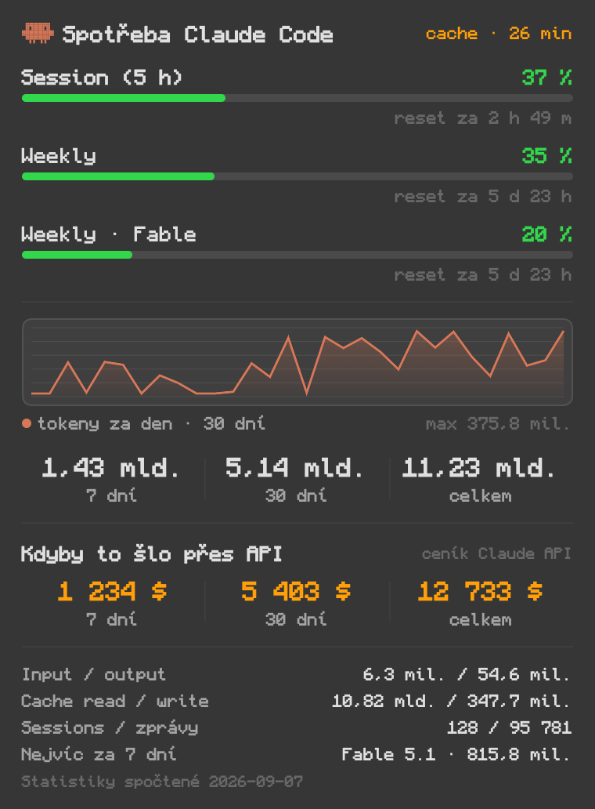

# Claude Usage

Widget do macOS lišty se spotřebou Claude Code. V liště procenta session a weekly
limitu, po rozkliknutí denní graf, tokeny za 7 / 30 dní i celkem a přepočet na cenu
Claude API.




## Instalace

```bash
git clone https://github.com/LiberaFatum/macOS-Claude-Code-usage-widget.git
cd macOS-Claude-Code-usage-widget
./install.sh
```

Přeloží se, nakopíruje do `/Applications/Claude Usage.app` a spustí. Potřebuje macOS 13+
a Command Line Tools (`xcode-select --install`), Xcode ne. Font [Monocraft](https://github.com/IdreesInc/Monocraft)
je volitelný, bez něj se použije systémový monospace.

Spouštění po restartu: **Nastavení > Spouštět po přihlášení**. Zapíše LaunchAgent do
`~/Library/LaunchAgents/com.liberafatum.claude-usage-widget.plist`, žádná binárka navíc.

## Odkud jsou data

| Zdroj | Co z něj bere |
| --- | --- |
| `https://api.anthropic.com/api/oauth/usage` | živá procenta limitů, volitelné, viz níže |
| `~/.claude.json`, klíč `cachedUsageUtilization` | tatáž procenta z cache, když živé čtení neběží |
| `~/.claude/stats-cache.json` | tokeny po dnech a modelech, celkové součty |

Statistiky tokenů se čtou vždy jen z lokálního souboru. Soubory se parsují pouze při
změně jejich času úpravy, takže widget na pozadí prakticky nic nedělá.

`cachedUsageUtilization` přepisuje Claude Code při startu a při příkazu `/usage`, mezitím
stárne. Proto to živé čtení.

`stats-cache.json` se přepočítává po dnech, graf tak většinou končí včerejškem.

## Živé čtení limitů

**Nastavení > Číst limity živě z API** volá stejný endpoint jako Claude Code. Token se
hledá v `~/.claude/.credentials.json` a pak v Keychainu, načte se jednou a drží se jen
v paměti. První čtení Keychainu vyvolá systémový dialog, potvrď **Vždy povolit**.

### Proč aplikace potřebuje vlastní podpis

Povolení "Povolit vždy" v Keychainu je navázané na otisk podepsané aplikace. Ad-hoc
podpis se mění při každém překladu, takže by povolení po každé aktualizaci propadlo
a systém by si znovu řekl o heslo. `install.sh` proto nejdřív vytvoří lokální
podpisovou identitu `Claude Usage Local` (`Tools/create-signing-identity.sh`) a podepíše
jí aplikaci. Požadavek podpisu pak zní `identifier "com.liberafatum.claude-usage-widget"
and certificate leaf = H"..."`, tedy nezávisle na obsahu binárky, a povolení v Keychainu
přežije každou aktualizaci. Certifikát zůstává jen na tvém stroji a nemusí být systémem
označen jako důvěryhodný, na podepisování to stačí. Odstraní ho `uninstall.sh`, nebo ručně:

```bash
security delete-identity -c "Claude Usage Local"
```

Token má omezenou platnost a obnovuje ho jen Claude Code. Widget si proto čte `expiresAt`
a po vypršení už na API nesahá, jen napíše do panelu, že se čeká na obnovu. Do Keychainu
sáhne nejvýš jednou za 15 minut, protože každé čtení může znovu vyvolat dialog s heslem.

Endpoint svůj limit četnosti nehlásí užitečně (na 429 posílá `retry-after: 0`), odstup
mezi dotazy se proto ladí za běhu: startuje na dvou minutách, po HTTP 429 se zdvojnásobí
až k patnácti minutám a po každém úspěchu klesá zpět ke dvěma minutám. Minuta byla
měřitelně příliš rychlá.

Hlavička panelu píše, jak staré číslo vidíš, po najetí myší i to, odkud pochází.
Nad 15 minut zoranžoví.

Ověření z terminálu, pozor, ukusuje ze stejného limitu jako běžící widget, takže
těsně po jeho dotazu vrátí 429:

```bash
"/Applications/Claude Usage.app/Contents/MacOS/ClaudeUsage" --test-api
```

Neúspěchy se zapisují do `~/Library/Logs/ClaudeUsage.log` včetně OSStatus z Keychainu.

## Přepočet na API

Ceny podle [oficiálního ceníku](https://platform.claude.com/docs/en/about-claude/pricing),
zvlášť input, output, cache read i cache write, per model. Číslo "celkem" je přesné.
Za 7 a 30 dní jde o odhad: denní data znají jen součet tokenů na model, rozpad na typy
se dopočítá z celkového poměru téhož modelu.

## Nastavení

V liště buď session, weekly, obojí, nebo vyšší z obou, ve tvaru `45 % s | 35 % w`.
Dál rozsah grafu (14 / 30 / 60 dní), ikona v liště, živé čtení z API a spouštění
po přihlášení.

## Odinstalace

```bash
./uninstall.sh
```

Smaže aplikaci, login item i uložené předvolby.

## Licence

MIT
